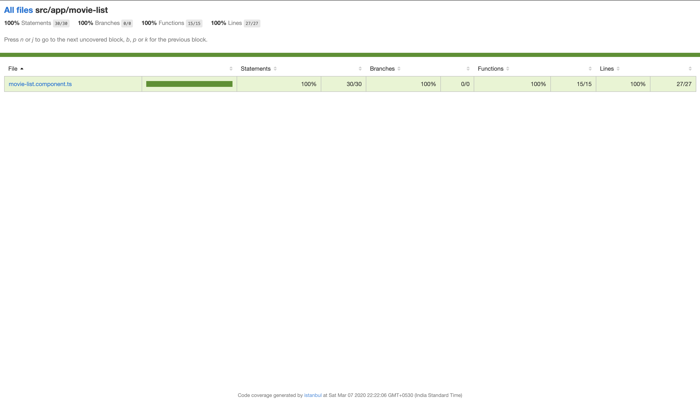

# Movie Rating App

This project was generated with [Angular CLI](https://github.com/angular/angular-cli) version 8.3.4.

Deployed URL : [movie-rating-app](https://movie-rating-app-a51d8.firebaseapp.com/)

## Table of Contents
1. [Development server](#development-server)
2. [Production Build](#production-build)
3. [Deployment](#deployment)
4. [Test Cases](#test-cases)
5. [Application Screenshots](#screenshots)
6. [Test Case Coverage Screenshots](#test-coverage-reports)
7. [Disclaimer](#disclaimer)

## Development server

Run `ng serve` for a dev server. Navigate to `http://localhost:4200/`. The app will automatically reload if you change any of the source files.

## Production Build

Run `ng build` to build the project. The build artifacts will be stored in the `dist/` directory. Use the `--prod` flag for a production build and `--aot` flag for aot build.

## Deployment

Run `npm run deploly` to deploy the application in firebase. 

## Running unit tests

Run `ng test` to execute the unit tests via [Karma](https://karma-runner.github.io).

## Screenshots
Landing page of the application

Listing the movies

Rating the film

Initiated the random rating

## Test Coverage Reports

Overall test coverage

Header component

Movie List component

Rating stars component

## Disclaimer 

The content & images are used in the application belongs to IMDB & Google.

